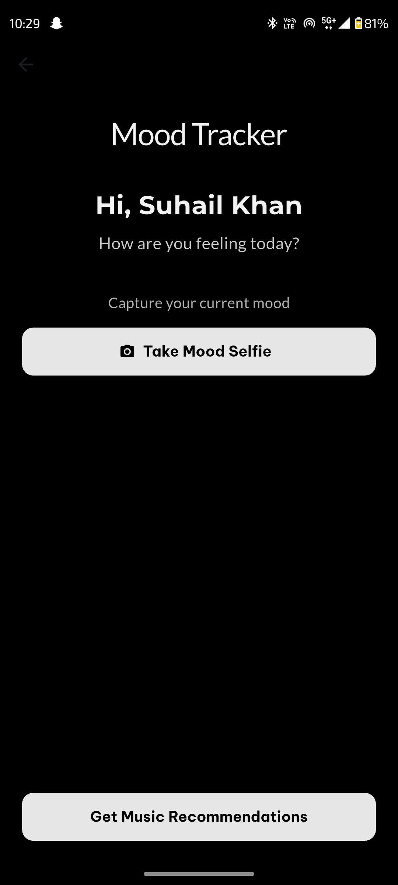

# EmotifAi – AI-Powered Mood-Based Spotify Song Recommender

**EmotifAi** is a cross-platform Flutter app that recommends Spotify playlists and songs tailored to your current mood. It combines real-time emotion detection using DeepFace, personalized feedback via Google Gemini API, and seamless Spotify integration to deliver a truly emotional music experience.

> **Solves:** The challenge of finding the right music for your mood—instantly, intelligently, and securely.

---

## 🚀 Features

- 🎵 **Spotify Music Recommendations**  
  Authenticate once with Spotify and get curated playlists that match your emotional state.

- 🤳 **AI Mood Detection from Selfie**  
  Choose a selfie via camera or gallery — analyzed using DeepFace hosted on FastAPI (Python).

- 🗣️ **Text/Voice Emotion Analysis**  
  Detect mood via typed or spoken input using the Gemini API for intelligent sentiment interpretation.

- 🧠 **AI-Generated Comfort Quotes**  
  Get personalized quotes from the Gemini API based on your detected mood.

- 🔐 **Secure Authentication**  
  Login/Register with Email or Google via Firebase, including email verification and in-app feedback for any errors.

- 🎨 **Modern UI/UX**  
  Smooth onboarding experience, responsive dark-themed design, and scrollable grid-based playlist layout.

---

## 📸 Screenshots

### ➤ Onboarding
 
 

### ➤ Authentication 
 
 

### ➤ Mood Detection & Recommendations
 
 

---

## 🛠️ Getting Started

1. **Clone the Repository**
git clone https://github.com/emotifai-org/emotifai-app.git
cd emotifai-app

2. **Install Dependencies**
flutter pub get

3. **Configure APIs**
- Set up your `.env` file with API keys (Gemini, etc.).
- Configure Spotify API credentials in your backend.
- Set up DeepFace and Gemini API endpoints.

4. **Run the App**
flutter run

---

## 🧑‍💻 Tech Stack

| Layer             | Technology                        |
|-------------------|-----------------------------------|
| Frontend          | Flutter (Dart)                    |
| Auth & Database   | Firebase (Email/Google Auth)      |
| Mood Detection    | DeepFace + FastAPI (Python)       |
| Quote Generator   | Gemini API (Google Cloud)         |
| Music Recommender | Spotify Web API                   |
| Token Proxy       | Node.js + Express                 |

---

## 🤝 Contributing

We welcome contributions from the community!

- Fork the repository
- Create a feature branch (`feature/your-feature`)
- Commit your changes
- Push to your fork and open a Pull Request

For major changes, please open an issue to discuss before starting.

---
